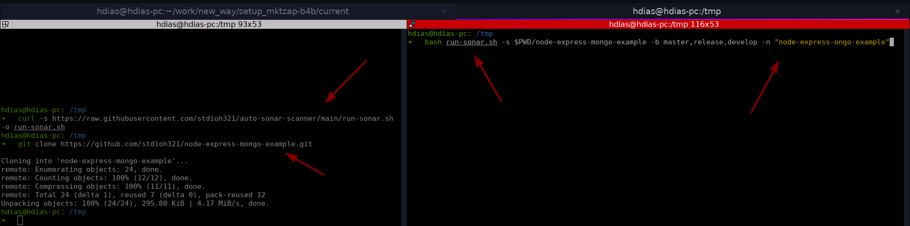
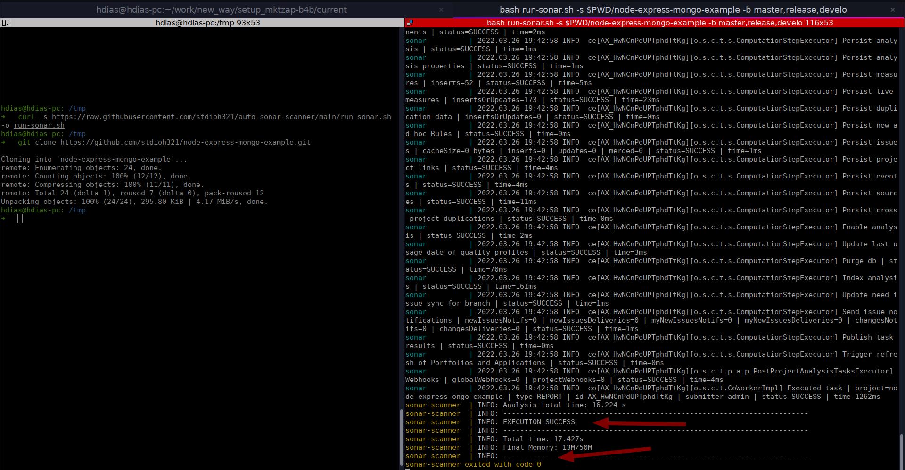
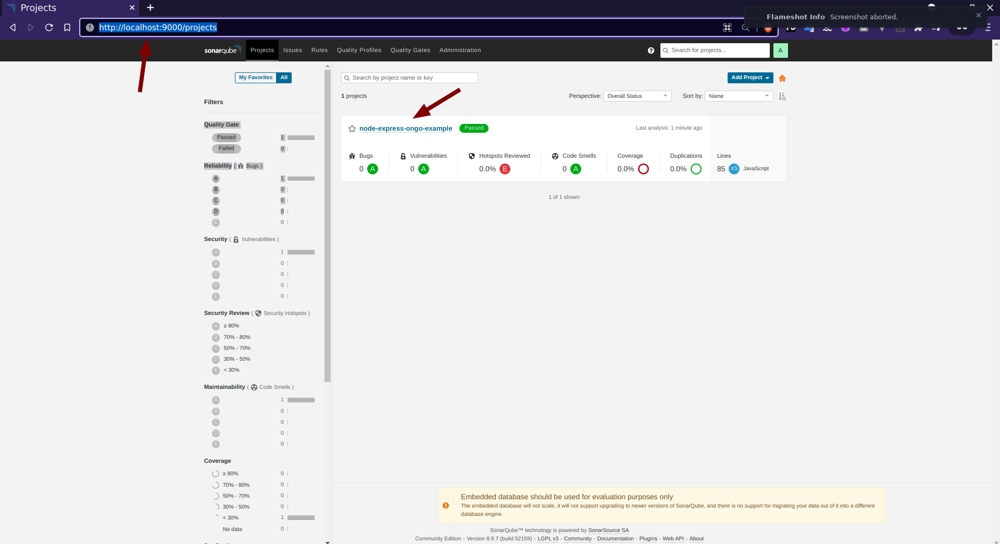
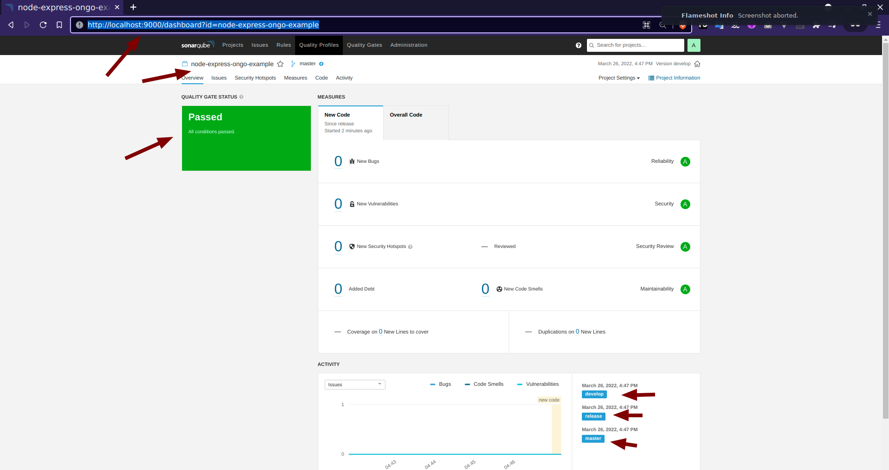
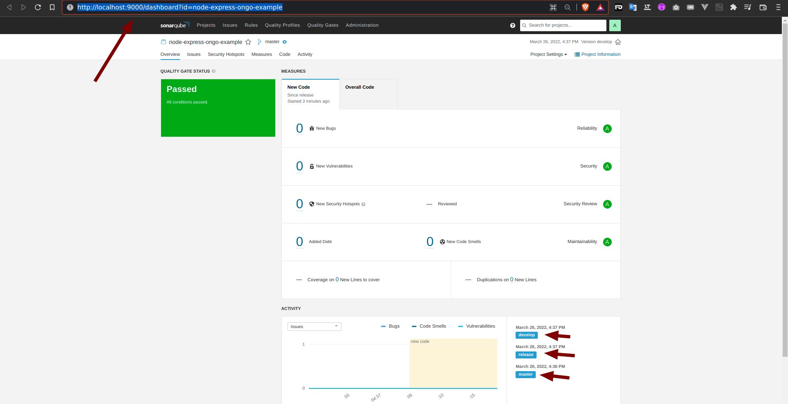

# auto-sonar-scanner
Projeto para executar Sonarqube e sonar-scanner utilizando o docker e docker-compose


# Requisitos 📝📝📝
* Deixar a porta **9000** aberta

## Aplicações
1. [curl](https://curl.se/download.html)
2. [docker](https://docs.docker.com/get-docker/)
3. [docker-compose](https://docs.docker.com/compose/install/)

# Run 🏃‍♀️🏃🏃‍♂️
```
curl -s https://raw.githubusercontent.com/stdioh321/auto-sonar-scanner/main/run-sonar.sh -o run-sonar.sh
bash run-sonar.sh -s CAMINHO_COMPLETO_DO_PROJETO -b BRANCHES_PARA_TESTE -n NOME_DO_PROJETO

# bash run-sonar.sh -s $PWD/node-express-mongo-example -b master,release -n "node-express-mongo-example"
```
> Deve demorar um pouco para que tudo seja processado

Será executado o sonarqube e sonar-scanner apontando para o projeto especificado, no terminal deve aparecer algo como na imagem abaixo

* Acesse a pagina do Sonarqube: **http://localhost:9000**
   * > Credencias -> **user:** admin / **pass:** Abc123@
* Acesse o link com o nome do projeto e veja os relatorios

|Download/Clone|Sonar-scanner|
|:---|:---|
|||

|Lista de Projetos|Relatórios|
|:---|:---|
|||

# Demo :biking_woman::biking_woman::biking_woman:
Projeto utilizado na demo https://github.com/stdioh321/node-express-mongo-example
```
curl -s https://raw.githubusercontent.com/stdioh321/auto-sonar-scanner/main/run-sonar.sh -o run-sonar.sh


git clone https://github.com/stdioh321/node-express-mongo-example.git

bash run-sonar.sh -s $PWD/node-express-mongo-example -b master,release,develop -n "node-express-mongo-example"
```
> Deve demorar um pouco para que tudo seja processado

|Download/Clone|Sonar-scanner|
|:---|:---|
|||

* Abra a página do Sonarqube: **http://localhost:9000/dashboard?id=node-express-mongo-example**
* Entre com as credências: 
  * > **user:** admin / **pass:** Abc123@

* Deve possuir 3 relatorios do sonar, references as branchs master,release e develop 

# Referencias
* https://www.sonarqube.org/
* https://docs.sonarqube.org/latest/analysis/scan/sonarscanner/
* https://hub.docker.com/r/diaslinoh/auto-sonar
* https://hub.docker.com/r/diaslinoh/auto-sonar-scanner