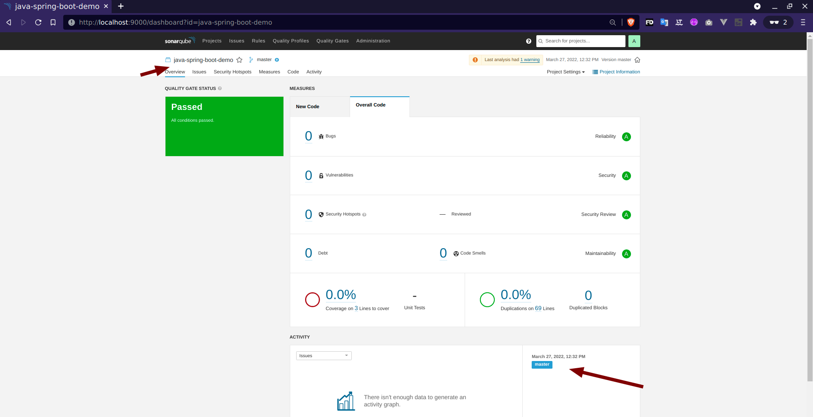

# auto-sonar-scanner
Projeto para executar Sonarqube e sonar-scanner utilizando o docker e docker-compose

# Requisitos 📝📝📝
* Deixar a porta **9000** aberta

## Aplicações
1. [curl](https://curl.se/download.html)
2. [docker >= 20.10.9](https://docs.docker.com/get-docker/)
3. [docker-compose >= v2.3.3](https://github.com/docker/compose/releases)

# Run 🏃‍♀️🏃🏃‍♂️
```
curl -s https://raw.githubusercontent.com/stdioh321/auto-sonar-scanner/main/run-sonar.sh -o run-sonar.sh
bash run-sonar.sh -s CAMINHO_COMPLETO_DO_PROJETO -b BRANCHES_PARA_TESTE -n NOME_DO_PROJETO -e "PARAMETROS_SONAR-SCANNER"

# bash run-sonar.sh -s $PWD/node-express-mongo-example -b master,release -n "node-express-mongo-example" -e "-Dsonar.language=javascript -Dsonar.sourceEncoding=UTF-8"
```
> Deve demorar um pouco para que tudo seja processado

Será executado o sonarqube e sonar-scanner apontando para o projeto especificado, no terminal deve aparecer algo como na imagem abaixo

* Acesse a pagina do Sonarqube: **http://localhost:9000**
   * > Credencias -> **user:** admin / **pass:** Abc123@
* Acesse o link com o nome do projeto e veja os relatorios

|Download/Clone|Sonar-scanner|
|:---|:---|
|||

|Lista de Projetos|Relatórios|
|:---|:---|
|||

# Demo :biking_woman::biking_woman::biking_woman:
Projeto utilizado na demo https://github.com/stdioh321/node-express-mongo-example
```
git clone https://github.com/stdioh321/node-express-mongo-example.git
cd node-express-mongo-example

curl -s https://raw.githubusercontent.com/stdioh321/auto-sonar-scanner/main/run-sonar.sh -o run-sonar.sh

bash run-sonar.sh -s $PWD -b master,release,develop -n "node-express-mongo-example"
```
> Deve demorar um pouco para que tudo seja processado

|Download/Clone|Sonar-scanner|
|:---|:---|
|||

* Abra a página do Sonarqube: **http://localhost:9000/dashboard?id=node-express-mongo-example**
* Entre com as credências: 
  * > **user:** admin / **pass:** Abc123@

* Deve possuir 3 relatórios do sonar, referentes as branchs master,release e develop 

# Demo - JAVA :biking_woman::biking_woman::biking_woman:
Projeto utilizado na demo **https://github.com/humbertodias/java-spring-boot-demo**
> Necessario ter o mvn instalado
```
git clone https://github.com/humbertodias/java-spring-boot-demo.git

cd java-spring-boot-demo
mvn package

curl -s https://raw.githubusercontent.com/stdioh321/auto-sonar-scanner/main/run-sonar.sh -o run-sonar.sh

bash run-sonar.sh -n java-spring-boot-demo -s $PWD -b master -e "-Dsonar.language=java -Dsonar.java.binaries=target/classes"
```
* Abra a página do Sonarqube: http://localhost:9000/dashboard?id=java-spring-boot-demo

* Entre com as credências:

  > user: admin / pass: Abc123@
* Veja o relatório
* 
# Referencias
* https://www.sonarqube.org/
* https://docs.sonarqube.org/latest/analysis/scan/sonarscanner/
* https://hub.docker.com/r/diaslinoh/auto-sonar
* https://hub.docker.com/r/diaslinoh/auto-sonar-scanner